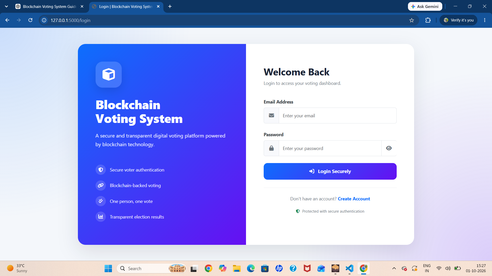
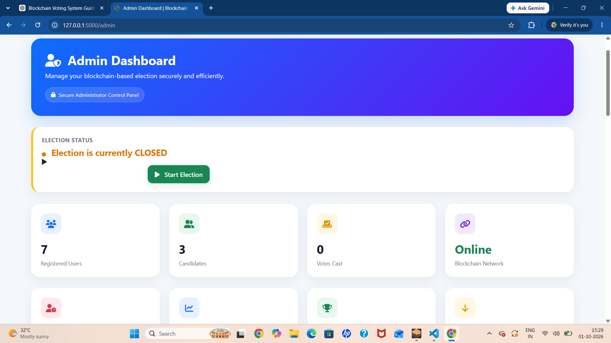
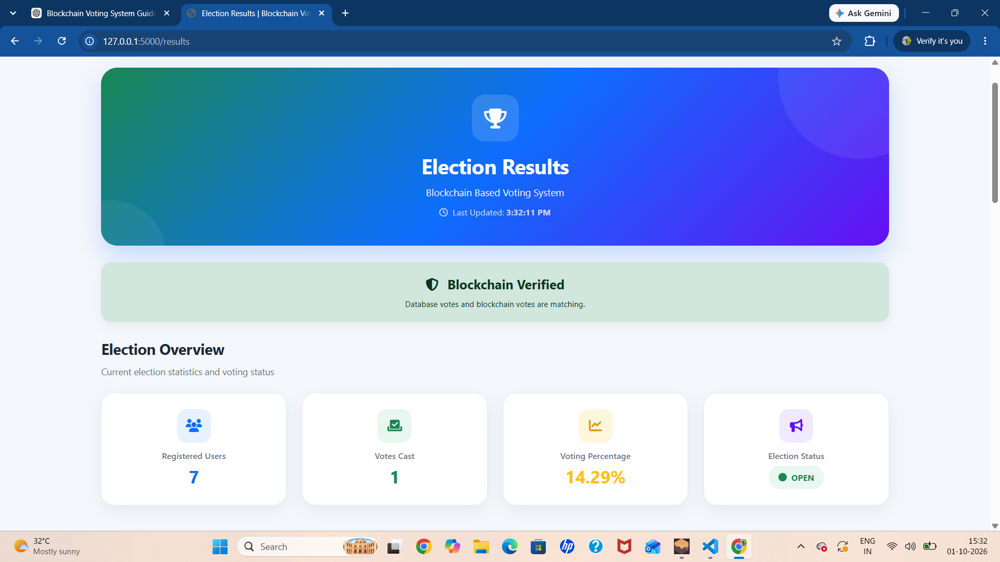
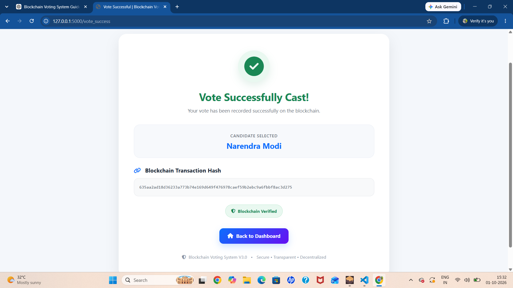
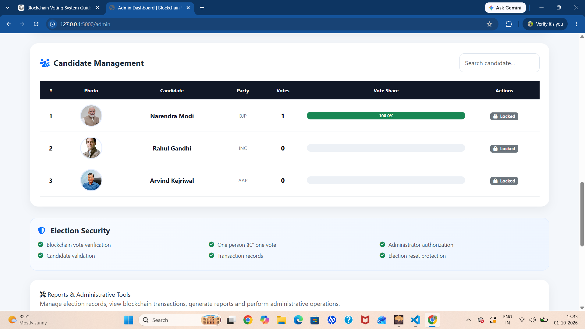
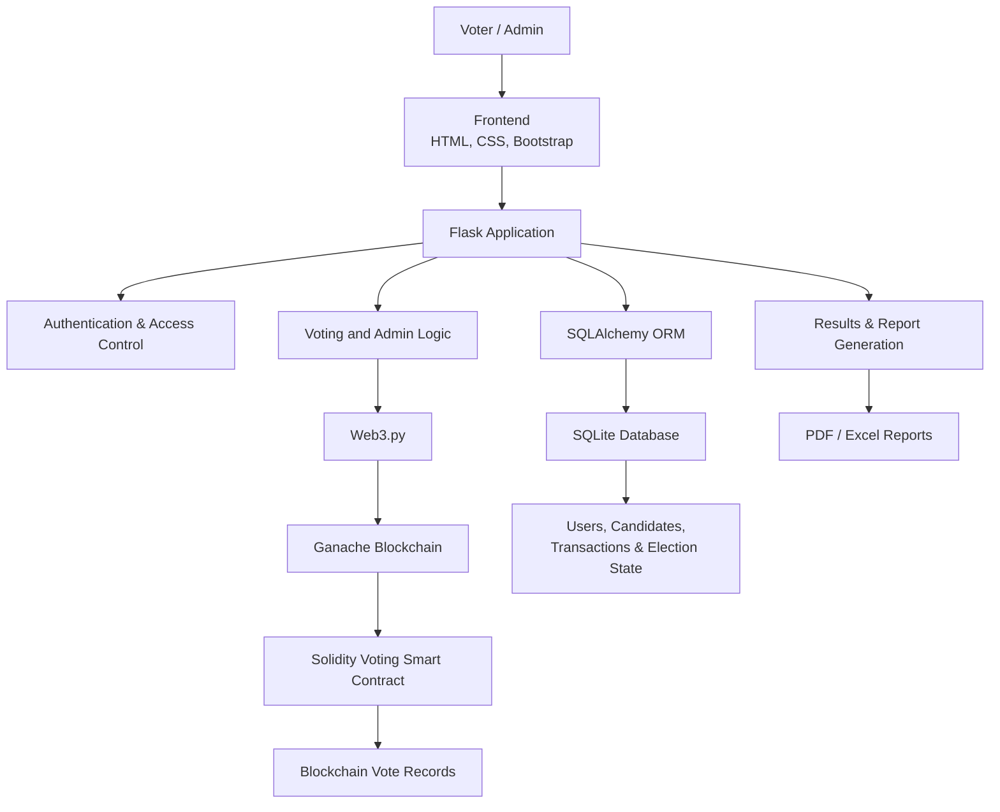
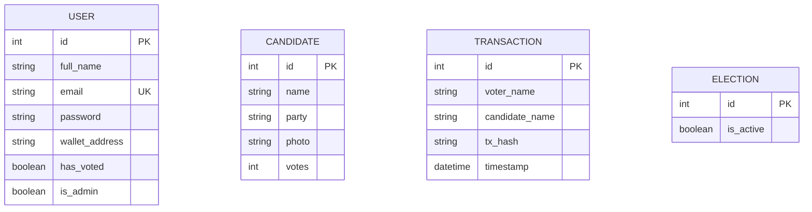

# Blockchain Voting System V3.0

A blockchain-based electronic voting system built using **Solidity, Ethereum, Web3.py, Flask, and SQLite**. The project combines blockchain-based vote recording with a web interface for voters and administrators.

## Features

* Voter registration and login
* Admin authentication and dashboard
* Candidate management
* Blockchain-based vote recording
* One-person-one-vote protection
* Election start, stop, and reset controls
* Live results and vote-count verification
* Transaction history
* PDF and Excel report exports
* CSRF protection and session security
* Database and blockchain synchronization

## Technology Stack

| Technology           | Purpose                                   |
| -------------------- | ----------------------------------------- |
| Python               | Backend programming                       |
| Flask                | Web framework                             |
| Solidity             | Smart contract                            |
| Ganache              | Local Ethereum blockchain                 |
| Web3.py              | Python–blockchain integration             |
| SQLite               | Database                                  |
| SQLAlchemy           | Database ORM                              |
| HTML, CSS, Bootstrap | Frontend                                  |
| Truffle              | Smart contract development and deployment |
| ReportLab            | PDF report generation                     |
| OpenPyXL             | Excel report generation                   |

## System Overview

The application uses Flask to manage user requests and application logic. Web3.py connects the backend to the deployed Solidity voting contract on Ganache. SQLite stores user accounts, candidate information, and transaction records.

## Main Modules

* **Voter Module:** Registration, login, candidate selection, and vote submission.
* **Admin Module:** Election controls, candidate management, and reporting.
* **Smart Contract:** Candidate vote counts, vote validation, and election ID management.
* **Results Module:** Displays election results and checks consistency between blockchain and database records.
* **Reporting Module:** Generates PDF and Excel reports.

## Project Setup

### Prerequisites

* Python
* Node.js and npm
* Ganache
* Truffle
* Git

### Installation

Clone the repository:

```bash
git clone https://github.com/ajinkyamahabare13/Blockchain-Voting-System.git
cd Blockchain-Voting-System
```

Create and activate a virtual environment:

```bash
python -m venv venv
```

Windows PowerShell:

```powershell
.\venv\Scripts\Activate.ps1
```

Install Python dependencies:

```bash
pip install -r requirements.txt
```

### Blockchain Setup

1. Start Ganache.
2. Compile and deploy the smart contract using the project's Truffle configuration.
3. Ensure the deployed contract address in `blockchain.py` matches the deployment.
4. Keep Ganache running while using the application.

### Run the Application

```bash
python app.py
```

Open the application in your browser:

```text
http://127.0.0.1:5000
```

## Security and Reliability

The project includes login/session checks, admin access control, CSRF protection, duplicate-vote prevention, election-state validation, and synchronization checks between blockchain and database records.

## Testing

The V3 application was manually tested for:

* Registration and login
* Admin access control
* Election start and stop
* Vote submission and duplicate-vote rejection
* Blockchain and database synchronization
* Election reset and post-reset state
* Results and transaction history
* PDF and Excel exports
* Flask restart and recovery

## Future Scope

* Integration with a public or test Ethereum network
* Stronger voter identity verification
* Independent smart-contract security audit
* Automated test suite and continuous integration
* Improved deployment and monitoring

## Author

**Ajinkya Mahabare**

GitHub: [ajinkyamahabare13](https://github.com/ajinkyamahabare13)

---

*This is an educational project demonstrating blockchain integration in an electronic voting application. It is not certified or intended for use in official public elections.*

## Screenshots

### Login Page


### Admin Dashboard


### Voting Page


### Election Results


### Vote Success


### Candidate Management



## System Architecture



## Database ER Diagram


